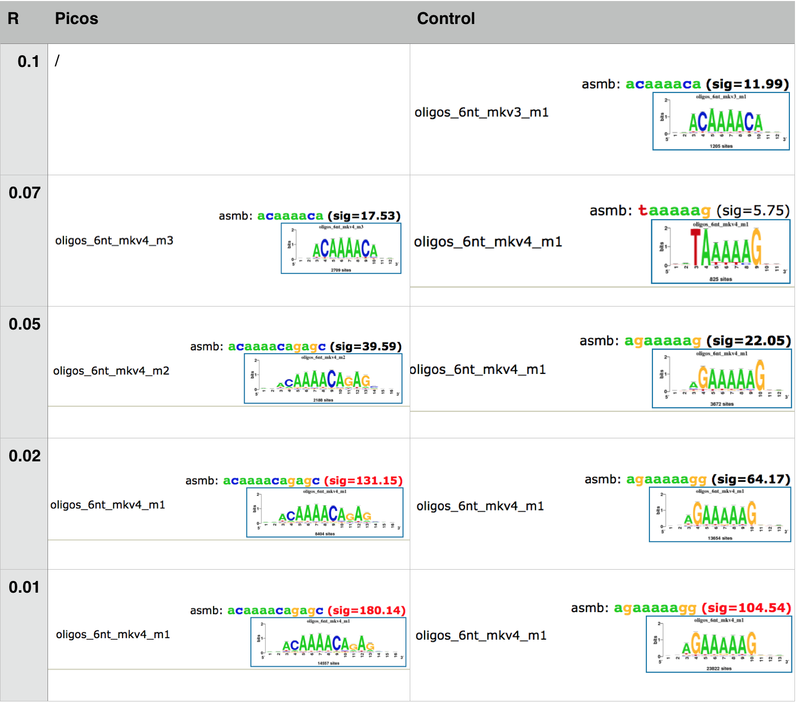

# Evaluación de Swembl bajo distintos valores del parámetro R con datos de ChIP-seq del factor transcripcional MYB3R3 en A. thaliana
####Bernardo Moreno Quiroga, Jesús Emiliano Sotelo Fonseca
## Introducción

Descubrir los sitios de unión de factores transcripcionales (TF) al genoma es una de las principales tareas en el estudio de la regulación genética. Es necesario saber en cuáles secuencias se unen preferencialmente, y en qué región del genoma se encuentran. Se han desarrollado varios métodos high throughput que permiten abordar este tipo de preguntas. Uno de ellos es ChIP seq, cuya lógica consiste en recuperar experimentalmente los fragmentos de ADN  a los que están unidos los TFs y secuenciarlos. Después se asume que las regiones genómicas que tengan más lecturas, o picos, son los sitios de unión. Sin embargo, existe mucho ruido en los experimentos, por lo que es un problema determinar cuáles picos representan los sitios verdaderos. Los programas bioinformáticos llamados peak callers, informan cuáles picos son los mejores candidatos. Hay una variedad de peak callers, y cada uno tiene sus propios parámetros. Esto significa que teniendo un mismo conjunto de picos, se pueden obtener resultados diferentes utilizando distintos parámetros o programas. En este trabajo se compara el rendimiento del peak caller SWEMBL bajo distintos valores de su parámetro R, con datos de ChIP seq del factor transcripcional MYB3R3 de A. thaliana. Abordamos dos estrategias. En la primera se compara la significancia de motivos descubiertos de novo en los conjuntos de picos. Por último se busca si los picos caen en regiones genómicas anotadas como reguladoras. 


## Métodos

Para realizar los métodos, se utilizaron los resultados del peak caller SWEMBL para distintos valores del parámetro R, 0.1, 0.07, 0.05, 0.02 y 0.01, donde 0.1 corresponde a criterios más estrictos, y 0.01 más relajados. 
Realizamos dos aproximaciones para evaluar la elección de picos: significancia de motivos descubiertos y anotación de picos

###Significancia de motivos descubiertos

Para realizar el descubrimiento de motivos, se utilizó el programa peak-motifs de RSAT. Cada uno de los conjuntos de picos fue utilizado para alimentar el programa. 
Los controles negativos se hicieron con el programa random gene fragments de RSAT. Esto permitió obtener secuencias al azar del genoma de A. thaliana que fueran del mismo tamaño que los picos utilizados. Esto se realizó para cada conjunto de datos de picos.  

###Anotación de picos

Se eligieron los promotores para revisar la fracción de picos en regiones regulatorias. Las regiones donde se encuentran los promotores en el genoma de Arabidopsis se obtuvieron de la base de datos AGRIS (Arabidopsis Gene Regulatory Information). Para analizar el sobrelape que existe entre las coordenadas resultado de Swembl y los rangos de promotores en el genoma se utilizó R, específicamente el paquete GenomicRanges de Bioconductor. 

## Resultados

###Significancia de motivos descubiertos 

Los motivos regresados por peak-motifs con los datos de SWEMBL tuvieron en general una significancia más alta que aquellos encontrados en los datos control. Sin embargo, en los datos control se encontraron algunos motivos con significancia considerable.  Esto puede deberse a la existencia de secuencias sobre representadas  en el genoma que no tienen que ver con sitios de unión de TFs. En específico, el genoma de A. thaliana es muy rico en AT, con casi 64%. Por esta razón se esperaría que al tomar regiones al azar existan muchas secuencias ricas en AT. Se observan motivos ricos en AT, especialmente con repetidos de AAA..., con significancia alta en todos los conjuntos de picos control. 

De manera interesante, en los conjuntos de datos de picos de SWEMBL con R de 0.01 a 0.7, pero no en R=0.1, también se recupera por lo menos un motivo consistente en repetidos de A  . Esto puede implicar que en esos valores de r los picos no se están filtrando lo suficiente como para evitar encontrar las secuencias esperadas por azar. Este efecto se observa sobre todo con R=0.01, donde se encontraron muchos motivos compuestos únicamente por AT con una significancia muy alta. Esto se explica porque es el conjunto de datos más grande, con 92695 picos. Como existe el sesgo de AT, al tomar muchas regiones del genoma, se recuperan más secuencias ricas en AT. A la hora de buscar los motivos, se encuentran mucho más enriquecidas este tipo de secuencias que si tuviéramos menos regiones. 

Con la R más estricta, es decir R=0.1, no se recuperó ningún motivo rico en AT. Si en efecto estos motivos aparecieran porque son sitios de unión, también se habría recuperado con el corte más estricto. Cabe destacar que al comparar los motivos de R=0.1 y su control, con los de R=0.01 y su control, se encontró un motivo que en el control de R=0.1 fue el que obtuvo más significancia, también se encontró en los datos de picos de R=0.01. Al usar un R=0.1 nos estaríamos asegurando de obtener motivos con significancia alta y diferentes a los motivos esperados al azar. Sin embargo, el número de picos de R=0.1 es pequeño, de 1352, por lo que podríamos no estar recuperando muchos motivos. En R=0.7, si se encuentra un motivo parecido a lo encontrado en el control, sin embargo excluyendo estos casos podríamos recuperar una muestra más grande. 

En la siguiente tabla se muestra una comparación de motivos ricos en A en los picos y en las regiones control. Conforme va aumentando el valor de R, los motivos ricos en A disminuyen su significancia y su diferencia con el control. Cuando R toma 0.1, ya no se recupera el motivo rico en A en los picos, pero se recupera en el control el mismo motivo que en los demás conjuntos de picos.




###Anotación de picos

Una manera de dar sustento a los picos sobre-representados es ver en qué regiones del genoma se localizan estos sitios de unión, debido a que sabemos que los factores de transcripción se unen al DNA en regiones regulatorias, entonces si encontramos que un pico no cae en secuencias regulatorias automáticamente podemos descartarlo como un buen motivo.

A continuación se muestra una tabla con los resultados obtenidos a partir de GenomicRanges.

| R-valor | 0.01 | 0.02 |  0.05 | 0.07 | 0.1 |
|---------|------|------|-------|------|-----|
| Número de coordenadas del archivo .bed | 92695 | 31867 | 6218 |2788 |1352 |
| Número de sobrelapes entre archivo .bed y rangos de los promotores | 17553 | 7245 | 1932 |879 | 448 |
| #sobrelapes/ #coordenadas | 0.1893 | 0.2273 | 0.3107 |0.3115 |0.33 |


Podemos observar que cuando fijamos un R-valor relajado tal como 0.01 el número de sobrelapes es muy grande (17,553), sin embargo al compararlo con el número total de coordenadas vemos que la proporción es poca (0.18), por lo que aunque tenemos una gran cantidad de posibles sitios de pegado lo más probable es que la mayoría de estos sean falsos positivos y que hayan sido generados por azar. Ahora, si nos vamos al otro extremo de la tabla podemos ver que aunque la proporción entre el sobrelape y el número de coordenadas es muy buena (0.33) el número de sobrelapes que encontramos es muy poco y aunque lo más probable es que los pocos picos sean verdaderos positivos, podemos estar perdiendo algunos otros debido a que estamos siendo muy estrictos con el R-valor (0.1). Si prestamos atención, la proporción entre el sobrelape y el número de coordenadas para los valores R de 0.5, 0.7 y 0.1 es muy parecido, por lo que cuál elegir más bien dependería de si nuestro interés es obtener muchos picos con mayor probabilidad de falsos negativos o bien, quedarnos con pocos sitios de pegado con una mayor probabilidad de ser verdaderos positivos.

```{r echo=FALSE}
barplot(c(0.1893,0.2273,0.3107,0.3115,0.33), main="", xlab="R-valor",  
        ylab="#sobrelapes / #coordenadas", names.arg=c(0.01, 0.02, 0.05, 0.07, 0.1), 
        border="black", density=c(10,20,30,40,50), col=rainbow(5))
```


* * * * * * 

## Conclusiones y perspectivas
Comparando los resultados de peak-motifs para cada conjunto de datos y sus respectivos controles, se concluyó que el valor de R que da resultados más significativos es 0.1. Este valor corresponde a un criterio estricto a la hora de seleccionar los picos. Por esta razón, el tamaño del conjunto de datos era pequeño. Aunque no arrojaba motivos encontrados en los controles, es posible que con R=0.1 no se observaron muchos motivos verdaderos. Es recomendable utilizar un valor de R de 0.7, teniendo en cuenta que se obtendrán un poco más de falsos positivos. Además, vale la pena comparar varios resultados de peak callers porque así se pueden encontrar motivos más representativos.  
Otro enfoque que sin duda complementa muy bien la toma de decisión sobre qué picos elegir como sitios de pegado verdaderos es la anotación de éstos en las bases de datos, ya que existen muchas herramientas bioinformáticas que facilitan el acceso al genoma anotado de distintos organismos, permitiendo identificar la función de secuencias o coordenadas de las cuales no tenemos conocimiento alguno de su función en el genoma, y con ello nos permite evaluar si son candidatas para ser el sitio de pegado de un factor transcripcional. Otro aspecto en el que fue de gran ayuda este enfoque fue que nos permitió visualizar para cada uno de los valores del parámetro R que se eligieron en el peak-calling cuál era aquel con el cual podíamos obtener mejores resultados. Sin duda algo muy interesante que podría hacerse después es identificar las funciones de las regiones regulatorias donde están cayendo estos picos, lo que nos daría mayor información sobre las funciones que tiene el factor de transcripción en la regulación de los distintos procesos celulares que se llevan a cabo dentro de un organismo.

* * * * * * 

## Material suplementario

### Fuentes de los datos
Los archivos con los datos utilizados se encuentran en la siguientes ligas.

| Datos | Description | URL | 
|---------|-------------|-----|
| Fasta | Secuencias de los picos | <https://github.com/jemilianosf/peak_calling/blob/master/fasta.zip> |
| Bed | Coordenadas de los picos | <https://github.com/jemilianosf/peak_calling/blob/master/bed.zip> |
| Promotores| Coordenadas de los promotores |<https://github.com/jemilianosf/peak_calling/blob/master/PromoterInfo.tbl> |

### Herramientas bioinformáticas utilizadas

En la siguiente tabla se listan los recursos bioinformáticos utilizados en este trabajo. 

| Acronym | Description | URL | 
|---------|-------------|-----|
| RSAT | Regulatory Sequence Analysis Tools | <http://rsat.eu/> |
| AGRIS | Arabidopsis Gene Regulatory Information System | <http://arabidopsis.med.ohio-state.edu> |
| GR| Genomic Ranges |<http://www.bioconductor.org/packages/release/bioc/html/GenomicRanges.html> |

### Lista completa de parámetros y comandos

####Significancia 

Se siguieron los siguientes pasos detallados con los parámetros indicados. 

#####Uso de peak - motifs 

1) Se subió cada secuencia contenida en (PATH) al programa peak-motifs en el servidor RSAT-Metazoa (http://rsat.sb-roscoff.fr), con todas las opciones por default, excepto en la sección "Compare discovered motifs with databases (e.g. against Jaspar) or custom reference motifs" se dejó de seleccionar la opción por default "Jaspar - vertebrales"). 

2) Para hacer los controles negativos, se usó el programa random gene fragments del servidor RSAT-Plants. En la opción Choose file, se utilizaron los archivos de secuencias fasta usadas en el punto anterior. En la sección Organismo, se eligió a Arabidopsis thaliana.TAIR10.29. En la opción Output, se seleccionó "Sequences in fasta format"  y "Mask repeats". Las secuencias obtenidas en este punto se alimentaron al programa "peak-motifs" con los mismos parámetros que en el punto anterior. 

3) Tanto para las secuencias de los picos como para el control, en la página de resultados del programa peak-motifs, se descargaron los resultados completos para tenerlos disponibles fuera de línea. Todos los resultados completos de peak - motifs se encuentran disponibles en la siguiente liga  <https://drive.google.com/open?id=0B4Or3ZAcLHjHVTZSOUpfemZnT00>.

Los comandos utilizados en RSAT para generar los motivos son los siguientes. 

######Picos

R=0.1 

peak-motifs  -v 1 -title swembl1 -i $RSAT/public_html/tmp/apache/2016/02/24/peak-motifs.2016-02-24.021211_2016-02-24.021211_CCz7md/peak-motifspeak_seq -max_seq_len 1000 -markov auto -disco oligos,positions -nmotifs 5 -minol 6 -maxol 7 -no_merge_lengths -2str -origin center -motif_db ArabidopsisPBM tf $RSAT/public_html/motif_databases/ArabidopsisPBM/ArabidopsisPBM_2015-11-06.tf -motif_db Athamap tf $RSAT/public_html/motif_databases/Athamap/Athamap_2015-11-06.tf -motif_db jaspar_core_vertebrates tf $RSAT/public_html/motif_databases/JASPAR/Jaspar_2016/jaspar_core_vertebrates_2016.tf -scan_markov 1 -source getfasta -task purge,seqlen,composition,disco,merge_motifs,split_motifs,motifs_vs_motifs,timelog,archive,synthesis,small_summary,motifs_vs_db,scan -prefix peak-motifs -noov -img_format png -outdir $RSAT/public_html/tmp/apache/2016/02/24/peak-motifs.2016-02-24.021211_2016-02-24.021211_CCz7md
 
R=0.07

peak-motifs  -v 1 -title r0.07 -i $RSAT/public_html/tmp/apache/2016/02/24/peak-motifs.2016-02-24.034041_2016-02-24.034041_T5BtmP/peak-motifspeak_seq -max_seq_len 1000 -markov auto -disco oligos,positions -nmotifs 5 -minol 6 -maxol 7 -no_merge_lengths -2str -origin center -scan_markov 1 -task purge,seqlen,composition,disco,merge_motifs,split_motifs,motifs_vs_motifs,timelog,archive,synthesis,small_summary,scan -prefix peak-motifs -noov -img_format png -outdir $RSAT/public_html/tmp/apache/2016/02/24/peak-motifs.2016-02-24.034041_2016-02-24.034041_T5BtmP

R=0.05 

peak-motifs  -v 1 -title r0.05 -i $RSAT/public_html/tmp/apache/2016/02/24/peak-motifs.2016-02-24.034020_2016-02-24.034020_fM79uW/peak-motifspeak_seq -max_seq_len 1000 -markov auto -disco oligos,positions -nmotifs 5 -minol 6 -maxol 7 -no_merge_lengths -2str -origin center -scan_markov 1 -task purge,seqlen,composition,disco,merge_motifs,split_motifs,motifs_vs_motifs,timelog,archive,synthesis,small_summary,scan -prefix peak-motifs -noov -img_format png -outdir $RSAT/public_html/tmp/apache/2016/02/24/peak-motifs.2016-02-24.034020_2016-02-24.034020_fM79uW

R=0.02 

peak-motifs  -v 1 -title r0.02 -i $RSAT/public_html/tmp/apache/2016/02/24/peak-motifs.2016-02-24.033923_2016-02-24.033923_gkvtpr/peak-motifspeak_seq -max_seq_len 1000 -markov auto -disco oligos,positions -nmotifs 5 -minol 6 -maxol 7 -no_merge_lengths -2str -origin center -scan_markov 1 -task purge,seqlen,composition,disco,merge_motifs,split_motifs,motifs_vs_motifs,timelog,archive,synthesis,small_summary,scan -prefix peak-motifs -noov -img_format png -outdir $RSAT/public_html/tmp/apache/2016/02/24/peak-motifs.2016-02-24.033923_2016-02-24.033923_gkvtpr
 
R=0.01 

peak-motifs  -v 1 -title r0.01 -i $RSAT/public_html/tmp/apache/2016/02/24/peak-motifs.2016-02-24.033757_2016-02-24.033757_pFAjSt/peak-motifspeak_seq -max_seq_len 1000 -markov auto -disco oligos,positions -nmotifs 5 -minol 6 -maxol 7 -no_merge_lengths -2str -origin center -scan_markov 1 -task purge,seqlen,composition,disco,merge_motifs,split_motifs,motifs_vs_motifs,timelog,archive,synthesis,small_summary,scan -prefix peak-motifs -noov -img_format png -outdir $RSAT/public_html/tmp/apache/2016/02/24/peak-motifs.2016-02-24.033757_2016-02-24.033757_pFAjSt
 |

######Controles

R=0.1 

peak-motifs  -v 1 -title control0.1 -i $RSAT/public_html/tmp/apache/2016/02/24/peak-motifs.2016-02-24.032332_2016-02-24.032332_Qy7b8y/peak-motifspeak_seq -max_seq_len 1000 -markov auto -disco oligos,positions -nmotifs 5 -minol 6 -maxol 7 -no_merge_lengths -2str -origin center -scan_markov 1 -task purge,seqlen,composition,disco,merge_motifs,split_motifs,motifs_vs_motifs,timelog,archive,synthesis,small_summary,scan -prefix peak-motifs -noov -img_format png -outdir $RSAT/public_html/tmp/apache/2016/02/24/peak-motifs.2016-02-24.032332_2016-02-24.032332_Qy7b8y
 
R=0.07 

peak-motifs  -v 1 -title controlR0.07 -i $RSAT/public_html/tmp/apache/2016/02/24/peak-motifs.2016-02-24.061409_2016-02-24.061409_C2piMg/peak-motifspeak_seq -max_seq_len 1000 -markov auto -disco oligos,positions -nmotifs 5 -minol 6 -maxol 7 -no_merge_lengths -2str -origin center -scan_markov 1 -task purge,seqlen,composition,disco,merge_motifs,split_motifs,motifs_vs_motifs,timelog,archive,synthesis,small_summary,scan -prefix peak-motifs -noov -img_format png -outdir $RSAT/public_html/tmp/apache/2016/02/24/peak-motifs.2016-02-24.061409_2016-02-24.061409_C2piMg

R= 0.05 

peak-motifs  -v 1 -title controlR0.05 -i $RSAT/public_html/tmp/apache/2016/02/24/peak-motifs.2016-02-24.061323_2016-02-24.061323_46XMRR/peak-motifspeak_seq -max_seq_len 1000 -markov auto -disco oligos,positions -nmotifs 5 -minol 6 -maxol 7 -no_merge_lengths -2str -origin center -scan_markov 1 -task purge,seqlen,composition,disco,merge_motifs,split_motifs,motifs_vs_motifs,timelog,archive,synthesis,small_summary,scan -prefix peak-motifs -noov -img_format png -outdir $RSAT/public_html/tmp/apache/2016/02/24/peak-motifs.2016-02-24.061323_2016-02-24.061323_46XMRR

R= 0.02 peak-motifs  -v 1 -title controlR0.02 -i $RSAT/public_html/tmp/apache/2016/02/24/peak-motifs.2016-02-24.061158_2016-02-24.061158_uVpNNj/peak-motifspeak_seq -max_seq_len 1000 -markov auto -disco oligos,positions -nmotifs 5 -minol 6 -maxol 7 -no_merge_lengths -2str -origin center -scan_markov 1 -task purge,seqlen,composition,disco,merge_motifs,split_motifs,motifs_vs_motifs,timelog,archive,synthesis,small_summary,scan -prefix peak-motifs -noov -img_format png -outdir $RSAT/public_html/tmp/apache/2016/02/24/peak-motifs.2016-02-24.061158_2016-02-24.061158_uVpNNj
 
R= 0.01 

peak-motifs  -v 1 -title controlR0.01 -i $RSAT/public_html/tmp/apache/2016/02/24/peak-motifs.2016-02-24.060945_2016-02-24.060945_5NtYSc/peak-motifspeak_seq -max_seq_len 1000 -markov auto -disco oligos,positions -nmotifs 5 -minol 6 -maxol 7 -no_merge_lengths -2str -origin center -scan_markov 1 -task purge,seqlen,composition,disco,merge_motifs,split_motifs,motifs_vs_motifs,timelog,archive,synthesis,small_summary,scan -prefix peak-motifs -noov -img_format png -outdir $RSAT/public_html/tmp/apache/2016/02/24/peak-motifs.2016-02-24.060945_2016-02-24.060945_5NtYSc
 


####Anotación de picos

El código en R para la anotación de picos se encuentra en el siguiente repositorio Github con el nombre de peak_annotation.R:
<https://github.com/jemilianosf/peak_calling/blob/master/peak_annotation.R>


* * * * * * *

